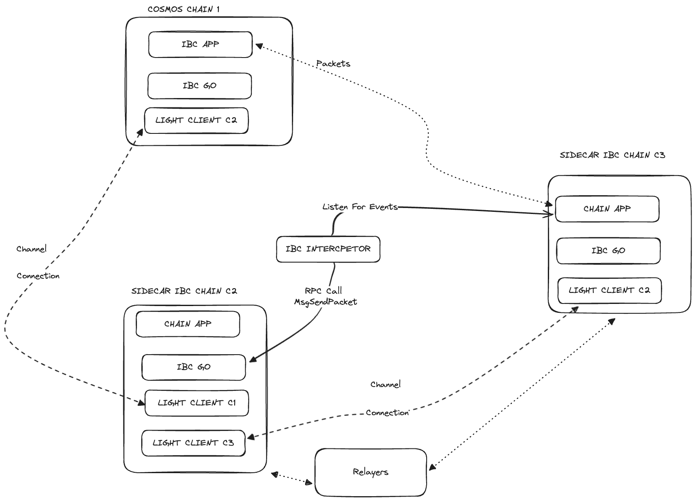

# Sidecar PoC

This repo contains:

- The testing directory used for this PoC should be placed under the $HOME folder.
- The interceptor code in Python.

## Configuration Design



[Escalidraw Link](https://excalidraw.com/#json=MXyV5YBJ3uRKTKJa2Lbo2,Mh5NL_M4mjD91nINhk2Dww)

Use [chain1](https://github.com/sangier-ibc-playground/ibc-go/tree/main) to generate the simd binary of chain1.
Use [chain2](https://github.com/sangier-ibc-playground/ibc-go/tree/stefano/async-send-packet-ibc-go) to generate the simd binary of chain2. Changes to the ibc-go codebase can be checked in this [PR](https://github.com/sangier-ibc-playground/ibc-go/pull/1).
Use [chain3](https://github.com/sangier-ibc-playground/ibc-go/tree/stefano/async-send-packet-tranfer-app) to generate the simd binary of chain3. Changes to the ibc-go codebase can be checked in this [PR](https://github.com/sangier-ibc-playground/ibc-go/pull/2).

### Setup

To set up the environment, follow this [tutorial](https://github.com/cosmos/ibc-go/blob/aad87e25c17697af23b1b227b0de3de4ee9d3a27/docs/tutorials/02-channel-upgrades/01-intro.md). Use the testing folder contained in this repo.

### Commands to setup keys

**Validators**

```bash
export VALIDATOR_CHAIN1=$(simd keys show validator -a --keyring-backend test --home ../../gm/chain1) && echo $VALIDATOR_CHAIN1;
export VALIDATOR_CHAIN2=$(simd keys show validator -a --keyring-backend test --home ../../gm/chain2) && echo $VALIDATOR_CHAIN2;
export VALIDATOR_CHAIN3=$(simd keys show validator -a --keyring-backend test --home ../../gm/chain3) && echo $VALIDATOR_CHAIN3;
```

**Relayers**

```bash
export RLY_CHAIN1=$(simd keys show wallet -a --keyring-backend test --home ../../gm/chain1) && echo $RLY_CHAIN1;
export RLY_CHAIN2=$(simd keys show wallet -a --keyring-backend test --home ../../gm/chain2) && echo $RLY_CHAIN2;
export RLY_CHAIN3=$(simd keys show wallet -a --keyring-backend test --home ../../gm/chain3) && echo $RLY_CHAIN3;

```

**setup connections and channels**

The Channel between Chain2 and Chain3 serves as a fake channel to get transfer app logic executed.

```bash
hermes --config config.toml create channel --a-chain chain2 \
--b-chain chain3 \
--a-port transfer \
--b-port transfer \
--new-client-connection
```

The channel between Chain1 and Chain2 is the channel between the Sidecar and DestChain channel.

```bash
hermes --config config.toml create channel --a-chain chain1 \
--b-chain chain2 \
--a-port transfer \
--b-port transfer \
--new-client-connection
```

**start relayer** 

```bash
hermes --config config.toml start
```

**Tx from V3 to V1**

```bash
simd tx ibc-transfer transfer transfer channel-0 $VALIDATOR_CHAIN1 100000samoleans \
--from $VALIDATOR_CHAIN3 \
--chain-id chain3 \
--keyring-backend test \
--home ../../gm/chain3 \
--node tcp://localhost:27020 \
--generate-only > transfer.json
```

```bash
simd tx sign transfer.json \
--from $VALIDATOR_CHAIN3 \
--chain-id chain3 \
--keyring-backend test \
--home ../../gm/chain3 \
--node tcp://localhost:27020 > signed.json
```

```bash
simd tx broadcast signed.json \
--home ../../gm/chain3 \
--node tcp://localhost:27020
```

**Check balances**

```bash
simd q bank balances $VALIDATOR_CHAIN1 --node http://localhost:27000
```

```bash
simd q bank balances $VALIDATOR_CHAIN2 --node http://localhost:27010
```

```bash
simd q bank balances $VALIDATOR_CHAIN3 --node http://localhost:27020
```