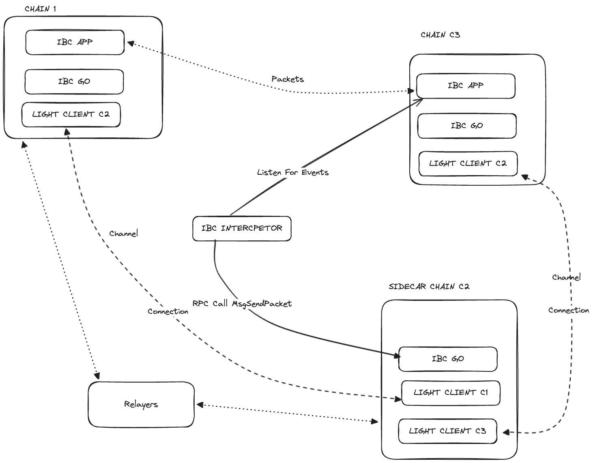

# Sidecar PoC

This repo contains:

- The testing directory used for this PoC which should be placed under the $HOME folder.
- The interceptor code in Python.

To set up the environment follow this [tutorial](https://github.com/cosmos/ibc-go/blob/aad87e25c17697af23b1b227b0de3de4ee9d3a27/docs/tutorials/02-channel-upgrades/01-intro.md). 

## Configuration Design

[Escalidraw Link](https://excalidraw.com/#json=sZVo3L-I1TA4cB5HYJSeT,wk8CTC3vmj5vbuVKqhO09Q)

## Useful commands

Commands to setup keys
---
`export VALIDATOR_CHAIN1=$(simd keys show validator -a \
--keyring-backend test \
--home ../../gm/chain1) && echo $VALIDATOR_CHAIN1;
export VALIDATOR_CHAIN2=$(simd keys show validator -a \
--keyring-backend test \
--home ../../gm/chain2) && echo $VALIDATOR_CHAIN2;
export VALIDATOR_CHAIN3=$(simd keys show validator -a \
--keyring-backend test \
--home ../../gm/chain3) && echo $VALIDATOR_CHAIN3;`

`export RLY_CHAIN1=$(simd keys show wallet -a \
--keyring-backend test \
--home ../../gm/chain1) && echo $RLY_CHAIN1;
export RLY_CHAIN2=$(simd keys show wallet -a \
--keyring-backend test \
--home ../../gm/chain2) && echo $RLY_CHAIN2;
export RLY_CHAIN3=$(simd keys show wallet -a \
--keyring-backend test \
--home ../../gm/chain3) && echo $RLY_CHAIN3;`
---

Commands to setup channels
---
// This Channel Chain2 Chain3 servers as a fake channel to get transfer app logic executed.

establish connection and ics20 channel: 
`hermes --config config.toml create channel --a-chain chain2 \
--b-chain chain3 \
--a-port transfer \
--b-port transfer \
--new-client-connection`

Sidecar and DestChain channel.

establish connection and ics20 channel: 
`hermes --config config.toml create channel --a-chain chain1 \
--b-chain chain2 \
--a-port transfer \
--b-port transfer \
--new-client-connection`

`start relayer: `hermes --config config.toml start`
---

Commands for Tx from V3 to V1
---
`simd tx ibc-transfer transfer transfer channel-0 $VALIDATOR_CHAIN1 100000samoleans \
--from $VALIDATOR_CHAIN3 \
--chain-id chain3 \
--keyring-backend test \
--home ../../gm/chain3 \
--node tcp://localhost:27020 \
--generate-only > transfer.json``

`simd tx sign transfer.json \
--from $VALIDATOR_CHAIN3 \
--chain-id chain3 \
--keyring-backend test \
--home ../../gm/chain3 \
--node tcp://localhost:27020 > signed.json``

`simd tx broadcast signed.json \
--home ../../gm/chain3 \
--node tcp://localhost:27020``
---

Commands for Tx from V1 to V2
---
`simd tx ibc-transfer transfer transfer channel-0 $VALIDATOR_CHAIN2 100000samoleans \
--from $VALIDATOR_CHAIN1 \
--chain-id chain1 \
--keyring-backend test \
--home ../../gm/chain1 \
--node tcp://localhost:27000 \
--generate-only > transfer.json`

`simd tx sign transfer.json \
--from $VALIDATOR_CHAIN1 \
--chain-id chain1 \
--keyring-backend test \
--home ../../gm/chain1 \
--node tcp://localhost:27000 > signed.json`

`simd tx broadcast signed.json \
--home ../../gm/chain1 \
--node tcp://localhost:27000``
---

Check balance

`simd q bank balances $VALIDATOR_CHAIN1 --node http://localhost:27000`